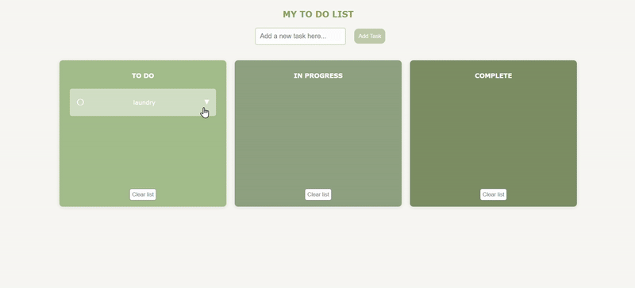

# To-Do: Task Management

> **Note**: This app is intended to run locally and does not include user login or cloud-based storage. It was built to learn and demonstrate full-stack structure and task management logic.

## Overview:

This is a task management web application. It includes the following features:
- Add tasks to one of three columns: To-Do, In-Progress, Complete.
- Keep track of details including: description, due-date and due-time.
- Modify details after posting the task.
- Clear the lists of tasks.
- Move the task to a different status column.
- Tasks persist between sessions.



## Getting Started

Follow these steps to run the web application on your local machine:

### 1. Clone the Repository

Clone this repository to your local machine in the desired directory:

```
git clone https://github.com/InbarMi/ToDo.git
```

### 2. Install Node.js and npm 

Before running the app, ensure you have Node.js and npm (Node's package manager) installed.
You can download and install the LTS version of Node.js from the official page at https://nodejs.org/en.

After installing Node.js, npm will be installed automatically. You can verify the installation by running
the following commands in your terminal:

```
node -v
npm -v
```

### 3. Install Dependencies

Navigate to the `back-end` directory in your terminal and run:

```
npm install
```
This will install all necessary dependencies listed in the `package.json` file.

### 4. Start the Server

From the `back-end` server, start the server by running:

```
node app.js
```

### 5. Access the Application

Once the server is running, you can navigate to http://localhost:8080 on a browser.
This should open the application and allow you to use it.


